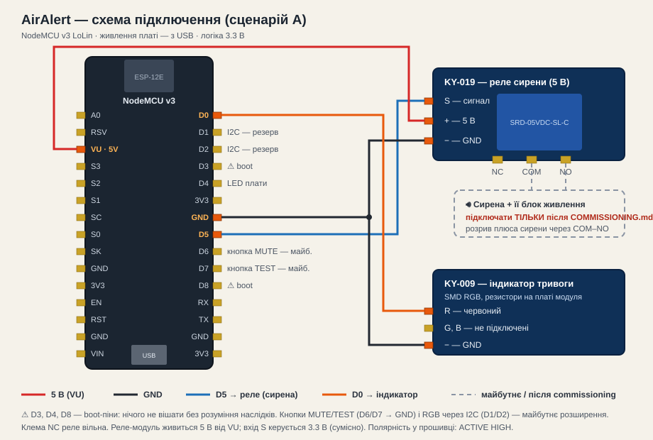

# AirAlert-ESP8266

Автономний сигналізатор повітряних тривог на NodeMCU v3 (ESP8266):
API ukrainealarm.com → реле/сирена + LED-індикація + Web UI. Без Raspberry Pi,
Home Assistant, MQTT-брокера чи хмарного сервера.

**Статус: 0.9 (pre-release).** Firmware-фази 0–9 завершені; commissioning
сценарію A пройдено на живому залізі (реле 5В на D5 + індикатор на D0,
полярність і safety перевірені). Зовнішнє code review (Codex) інтегровано.
Залишилось: підключення сирени до клем реле, safety-тест із Web UI, тег 1.0.

## Можливості

- усі типи загроз ukrainealarm.com + невідомі (forward-compatible); жовтий
  (дрони) і червоний (ракети) рівні повітряної тривоги — окремі профілі сигналів
- кілька локацій одночасно, ієрархічний matching (область ⊃ район)
- часткові тривоги з окремою політикою LED/сирени
- state machine з підтвердженнями: старт швидкий (1), відбій обережний (2)
- відсутність API ≠ відбій: stale-стан утримує останні достовірні дані
- сирена патернами (start/reminder/end, на тип загрози), пріоритети, черга
- фізичні MUTE (until-clear / snooze) і TEST, safety-ліміт реле 30 с
- Web UI українською: дашборд, локації, профілі, журнал, діагностика, OTA
- provisioning: перший бут → AP + captive portal
- OTA: upload або HTTPS URL + SHA-256

## Схема підключення



## Швидкий старт

```bash
pio test -e native                  # 100 тестів бізнес-логіки
pio run -e nodemcuv2_prod           # прошивка
py -3 -m esptool --port COM3 --baud 921600 write-flash 0x0 \
    .pio/build/nodemcuv2_prod/firmware.bin
```

Перший запуск: пристрій підніме AP `AirAlert-XXXX` (випадковий пароль/ключ
налаштування — у серіал-лозі, 115200), відкрийте http://192.168.4.1/ → введіть
цей ключ, Wi-Fi, токен
[ukrainealarm.com](https://api.ukrainealarm.com/swagger/index.html), пароль адміністратора.

## ⚠ Безпека

- Сирену підключати ТІЛЬКИ після процедури docs/COMMISSIONING.md.
- Реле стартує вимкненим і має незалежний таймерний ліміт безперервної роботи.
- Web UI — лише в довіреній локальній мережі (docs/SECURITY.md).

## Документація

- **[Посібник користувача](docs/USER-GUIDE.md)** — налаштування і щоденна робота
- [Серіал-консоль](docs/SERIAL.md) — всі команди
- Розробка: [ARCHITECTURE](docs/ARCHITECTURE.md) · [HARDWARE](docs/HARDWARE.md) ·
  [API](docs/API.md) · [CONFIGURATION](docs/CONFIGURATION.md) ·
  [TESTING](docs/TESTING.md) (з емулятором API) · [OTA](docs/OTA.md) ·
  [SECURITY](docs/SECURITY.md) · [COMMISSIONING](docs/COMMISSIONING.md) ·
  [TROUBLESHOOTING](docs/TROUBLESHOOTING.md) · [RELEASE](docs/RELEASE.md) ·
  [RESEARCH](docs/RESEARCH.md) · [SPEC](docs/SPEC.md) (повне ТЗ, 216 розділів)

## Джерело даних

[ukrainealarm.com](https://www.ukrainealarm.com) — дотримуйтесь лімітів API
(вбудований мінімум 10 с між запитами). Ліцензія: MIT.
