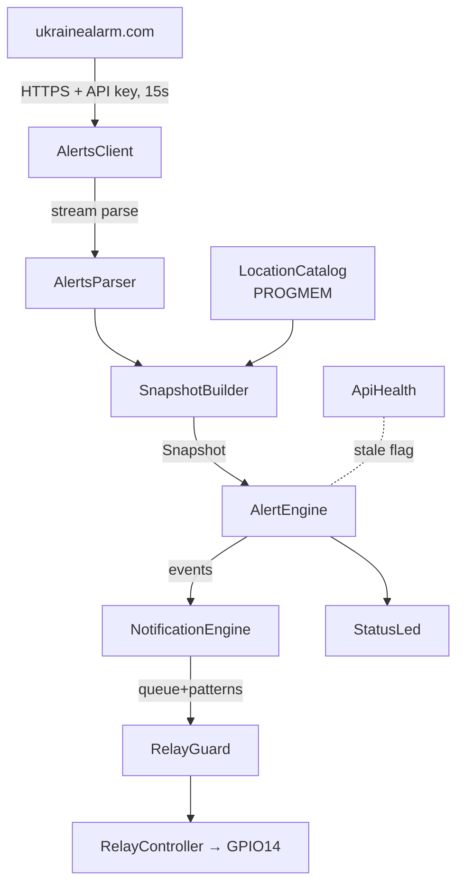
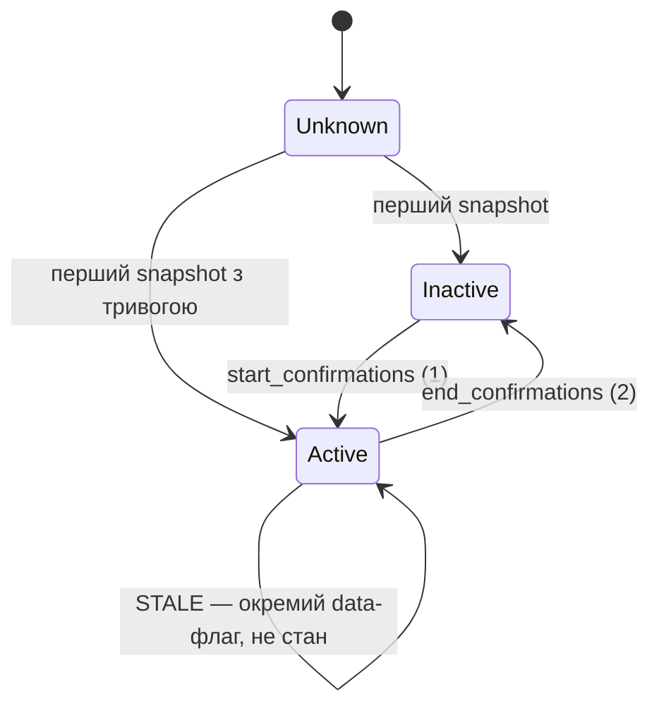

# Архітектура

## Потік даних

## Стан тривоги (SPEC 152)

## Шари

| Шар | Де | Залежності | Тести |
|---|---|---|---|
| Чиста логіка | `lib/core/` | тільки C++17 + ArduinoJson | 100 native-тестів |
| Транспорт | `src/alerts/` | BearSSL, HTTPClient | live на платі |
| Залізо | `src/hardware/` | Arduino GPIO | commissioning |
| Мережа | `src/network/` | ESP8266WiFi, DNSServer | live |
| Web | `src/web/` | ESP8266WebServer | браузер |
| Сховище | `src/config/`, `src/storage/` | LittleFS | live + native (формат) |

Ключовий принцип (SPEC 109-110): AlertEngine/LocationMatcher/PatternScheduler/
NotificationEngine не знають про Arduino — вони тестуються на хості й
переносяться на ESP32 без змін.

## Інваріанти (SPEC 211) і де вони живуть

| # | Інваріант | Реалізація | Тест |
|---|---|---|---|
| 1 | API недоступне ≠ відбій | ApiHealth окремо від AlertEngine | test_integration |
| 2 | Реле не довше ліміту | RelayGuard всередині RelayController | test_pattern |
| 3 | Бут = реле OFF | перший рядок setup() | on-device |
| 4 | MUTE → реле OFF миттєво | muteNow(): forceOff перед mute | test_notify |
| 5 | Одна локація очистилась ≠ кінець | агрегація в SnapshotBuilder | test_engine |
| 6 | Битий JSON не чіпає стан | транзакційний applySnapshot | test_parser |
| 7 | Токен ніде не світиться | write-only API, show → "configured" | code review |
| 8 | OTA тільки з вимкненим реле | prepareOta() перед Update.begin | code review |
| 9 | Невідомі типи не крашать | AlertType::Unknown + skipped | test_parser |
| 10 | START швидший за END | confirmations 1/2 | test_engine |
