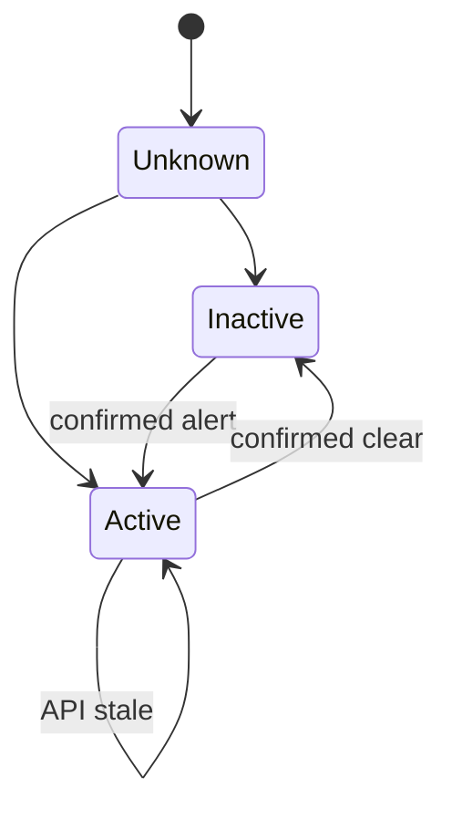

# AirAlert-ESP8266

## Повне технічне завдання, архітектура та план реалізації

**Статус документа:** Final specification  
**Цільова платформа:** NodeMCU v3 LoLin / ESP8266 / 4 MB Flash  
**Framework:** Arduino Framework  
**Build system:** PlatformIO  
**Мова firmware:** C++17  
**Мова Web UI:** українська  
**Основне джерело даних:** alerts.in.ua  
**Робоча назва проєкту:** `AirAlert-ESP8266`

---

# 1. Мета проєкту

Розробити повністю автономний пристрій оповіщення про повітряні тривоги та інші загрози на основі:

- NodeMCU v3 LoLin ESP8266;
- Wi-Fi;
- API alerts.in.ua;
- одного релейного виходу;
- зовнішньої сирени;
- RGB LED-індикації;
- фізичних кнопок MUTE та TEST;
- локальної Web UI;
- OTA-оновлення.

Пристрій не повинен залежати від:

- Raspberry Pi;
- Home Assistant;
- MQTT broker;
- зовнішнього сервера;
- хмарного backend;
- окремої бази даних.

Єдиним обов'язковим зовнішнім сервісом для отримання даних про загрози є **alerts.in.ua**.

---

# 2. Основний принцип

Пристрій є не простим:

```text
alert = true -> relay ON
```

а автономним контролером подій зі state machine:

```text
alerts.in.ua
      |
      v
API Client
      |
      v
Alert Parser
      |
      v
Location Matcher
      |
      v
Alert State Engine
      |
      +-------------------+
      |                   |
      v                   v
Pattern Engine        LED Engine
      |                   |
      v                   v
Relay / Siren         RGB LEDs
```

Окремими підсистемами працюють:

```text
Wi-Fi Manager
NTP
Web UI
REST API
Configuration Manager
Event Log
OTA Manager
Watchdog
Diagnostics
Button Manager
```

---

# 3. Базові функціональні вимоги

Пристрій повинен підтримувати:

1. вибір локацій;
2. декілька локацій одночасно;
3. області;
4. райони;
5. громади;
6. міста зі спеціальним статусом;
7. всі типи загроз API alerts.in.ua;
8. початок тривоги;
9. активну тривогу;
10. завершення тривоги;
11. часткову тривогу;
12. окремий сценарій сирени для кожного типу;
13. повторні сигнали;
14. налаштування тривалості сигналів;
15. обмеження максимальної роботи сирени;
16. MUTE;
17. TEST;
18. два RGB LED;
19. Web UI;
20. пароль адміністратора;
21. OTA upload;
22. OTA за URL;
23. GitHub Releases OTA;
24. журнал подій;
25. REST API;
26. автоматичне відновлення Wi-Fi;
27. captive/setup portal;
28. watchdog;
29. fail-safe поведінку при недоступності API;
30. збереження стану між reboot;
31. optional MQTT.

---

# 4. alerts.in.ua API

## 4.1. Основний runtime endpoint

Основним джерелом даних повинен бути:

```text
/v1/alerts/active.json
```

Не використовувати окремі API-запити для кожної локації.

Один запит повинен отримувати весь набір активних подій, після чого firmware локально виконує:

```text
filter
 -> selected locations
 -> hierarchy matching
 -> type matching
 -> state transition
```

Це принципове архітектурне рішення.

---

# 5. Авторизація

API token передавати виключно:

```http
Authorization: Bearer <TOKEN>
```

Не використовувати:

```text
?token=...
```

оскільки token у query string може випадково потрапити:

- у логи;
- diagnostics;
- URL history;
- debug output.

---

# 6. Захист API token

Заборонено:

```text
hardcode token in source
commit token
put token in platformio.ini
put token in README
put token in tests
send token to frontend
return token through REST API
log token
display complete token in Web UI
```

Web UI повинна показувати тільки:

```text
API token: configured
```

або, за необхідності:

```text
********************
```

Token вводиться через Web UI.

Endpoint читання конфігурації ніколи не повертає token.

---

# 7. API rate limiting

Firmware повинна бути свідомо спроєктована нижче лімітів alerts.in.ua.

Рекомендований default:

```text
poll_interval = 15 seconds
```

тобто:

```text
4 requests/minute
```

Мінімально дозволене значення через Web UI:

```text
10 seconds
```

Не дозволяти користувачу виставити:

```text
1 sec
2 sec
5 sec
```

---

# 8. HTTP caching

Обов'язково реалізувати:

```http
Last-Modified
If-Modified-Since
```

Після `200 OK`:

```text
remember Last-Modified
```

У наступному request:

```http
If-Modified-Since: <previous Last-Modified>
```

При:

```http
304 Not Modified
```

не виконувати повторний rebuild alert state.

Однак `304` вважається успішним контактом з API:

```text
api_online = true
data_stale = false
last_api_contact = now
```

---

# 9. HTTP error handling

Розрізняти:

```text
200
304
401
403
429
5xx
timeout
DNS failure
TLS failure
Wi-Fi failure
invalid JSON
```

Особливо важливо:

```text
API ERROR != NO ALERT
```

При відсутності API заборонено автоматично робити:

```text
ALERT -> CLEAR
```

---

# 10. Backoff

При успішній роботі:

```text
15 sec
```

При помилках:

```text
15
30
60
120
120
120...
```

секунд.

Для `429`:

```text
Retry-After
```

якщо header доступний.

Інакше:

```text
minimum 60 sec backoff
```

Додати невеликий jitter.

---

# 11. Типи загроз

Обов'язково підтримувати:

```text
air_raid
artillery_shelling
urban_fights
chemical
nuclear
```

Внутрішній enum:

```cpp
enum class AlertType {
    AirRaid,
    ArtilleryShelling,
    UrbanFights,
    Chemical,
    Nuclear,
    Unknown
};
```

`Unknown` необхідний для forward compatibility.

Невідомий тип не повинен crash-ити firmware.

---

# 12. Локації

Типи:

```text
oblast
raion
hromada
city
unknown
```

Web UI повинна дозволяти вибирати декілька локацій.

Наприклад:

```text
[x] Київська область
[x] Бучанський район
[x] Ірпінська територіальна громада
[ ] м. Київ
```

---

# 13. Каталог локацій

На момент створення цього документа alerts.in.ua не має документованого runtime endpoint:

```text
GET /locations
```

для отримання повного каталогу.

Офіційний довідник UID публікується окремою таблицею alerts.in.ua.

Тому реалізувати:

```text
official location source
        |
        v
tools/update_locations.py
        |
        v
normalize
        |
        v
locations.generated.json
        |
        v
gzip / C++ embedding
        |
        v
firmware
```

---

# 14. Генератор каталогу

Створити:

```text
tools/update_locations.py
```

Він повинен:

1. завантажувати офіційний каталог;
2. перевіряти формат;
3. нормалізувати UID;
4. нормалізувати тип;
5. перевіряти дублікати;
6. визначати hierarchy;
7. сортувати дані;
8. створювати machine-readable JSON;
9. створювати minified JSON;
10. створювати gzip asset;
11. зберігати metadata.

Результат:

```json
{
  "schema": 1,
  "generated_at": "...",
  "source": "alerts.in.ua",
  "locations": []
}
```

---

# 15. Модель Location

```cpp
struct Location {
    uint16_t uid;

    LocationType type;

    String name;

    uint16_t oblastUid;
    uint16_t raionUid;
};
```

Для Web UI каталог може містити додатково:

```json
{
  "uid": 123,
  "name": "...",
  "type": "hromada",
  "oblast_uid": 14,
  "raion_uid": 67
}
```

---

# 16. Ієрархічний matching

Це одна з найважливіших частин проєкту.

Приклад:

```text
Київська область
   |
   +-- Бучанський район
         |
         +-- Ірпінська громада
```

Якщо вибрана:

```text
Ірпінська громада
```

а API оголосило тривогу для:

```text
Київська область
```

Ірпінська громада також повинна вважатися такою, що знаходиться під тривогою.

---

# 17. Parent matching

Для selected location:

```text
selected = hromada
```

alert:

```text
alert = oblast
```

результат:

```text
ACTIVE
```

Так само:

```text
selected hromada
alert raion
=> ACTIVE
```

---

# 18. Child matching

Якщо вибрана:

```text
oblast
```

а alert тільки:

```text
one hromada inside oblast
```

результат:

```text
PARTIAL
```

---

# 19. Partial alerts

Внутрішня модель:

```cpp
enum class Coverage {
    None,
    Partial,
    Full
};
```

Агрегація:

```text
any Full     => FULL
else any Partial => PARTIAL
else         => NONE
```

---

# 20. Налаштування Partial

Web UI:

```text
Часткова тривога

[x] Вважати часткову тривогу активною
[x] Вмикати LED
[x] Вмикати сирену
```

Default:

```text
partial_active = true
partial_led = true
partial_siren = true
```

Користувач може вимкнути siren для `P`, залишивши LED.

---

# 21. Multi-location

При виборі:

```text
Location A
Location B
Location C
```

система повинна вести стан кожної окремо.

Глобальний стан типу загрози:

```text
ACTIVE if ANY selected location active
```

Не можна завершувати alert, якщо:

```text
Location A clear
Location B still alert
```

---

# 22. Alert identity

Використовувати API alert `id` як основний ідентифікатор.

Додатковий fingerprint:

```text
type
location_uid
started_at
```

для захисту від нестандартних API випадків.

---

# 23. Alert state machine

Основна модель:

```text
UNKNOWN
   |
   v
INACTIVE
   |
   | new confirmed alert
   v
STARTING
   |
   v
ACTIVE
   |
   | alert gone
   v
ENDING
   |
   v
INACTIVE
```

Додатково:

```text
STALE
MUTED
```

не повинні замінювати AlertState.

Вони є окремими flags.

---

# 24. Network state machine

```text
BOOT
 |
 v
WIFI_CONNECTING
 |
 v
TIME_SYNC
 |
 v
API_INITIAL_SYNC
 |
 v
READY
```

Помилки:

```text
READY
 |
 +--> API_DEGRADED
 |
 +--> WIFI_OFFLINE
```

Provisioning:

```text
WIFI_CONNECTING
 |
 | timeout
 v
PROVISIONING_AP
```

OTA:

```text
READY -> OTA_MODE -> REBOOT
```

---

# 25. Boot behavior

При старті firmware порядок суворо:

```text
1 relay SAFE/OFF
2 initialize watchdog
3 initialize GPIO
4 load config
5 initialize LEDs
6 initialize filesystem
7 initialize Wi-Fi
8 sync time
9 initialize TLS
10 fetch alerts
11 restore previous alert snapshot
12 calculate state
13 enable notification engine
14 start regular polling
```

Relay OFF має бути встановлений **до будь-якої мережевої операції**.

---

# 26. Startup під час активної тривоги

Обрана політика:

```text
SHORT_NOTIFICATION
```

Якщо після reboot API показує активну тривогу:

```text
LED = ACTIVE
```

та виконується короткий startup pattern.

Не запускати повний START pattern.

---

# 27. Startup pattern

Default:

```text
ON  1000 ms
OFF
```

Один раз.

Повинен бути налаштовуваним.

---

# 28. Захист від reboot loop

Необхідно зберігати fingerprint останніх активних alert.

Якщо пристрій:

```text
boot
short siren
crash
boot
short siren
crash
...
```

не можна нескінченно активувати сирену.

Зберігати:

```text
last_startup_notification
active_alert_fingerprint
```

та встановити cooldown, наприклад:

```text
5 minutes
```

---

# 29. Confirmation / debounce

Початок:

```text
start_confirmations = 1
```

тобто швидка реакція.

Кінець:

```text
end_confirmations = 2
```

Default polling 15 секунд:

```text
відбій підтверджується приблизно через 15 секунд
```

Це зменшує false-clear.

Параметри можуть бути внутрішніми advanced settings.

---

# 30. Stale state

Два незалежні значення:

```text
alert_state
data_state
```

Наприклад:

```text
alert_state = ACTIVE
data_state = STALE
```

означає:

> Останній достовірний стан — тривога, але нових даних немає.

Ніколи не перетворювати це автоматично на:

```text
CLEAR
```

---

# 31. Stale threshold

Default:

```text
60 seconds
```

або приблизно:

```text
4 missed polls
```

Config:

```text
api_stale_after_sec
```

---

# 32. Reminders під час STALE

Default:

```text
reminders_when_stale = false
```

Тобто:

- активна тривога залишається на LED;
- сирена повторно не вмикається;
- SYSTEM LED показує API problem.

---

# 33. Відновлення API

Після:

```text
STALE -> ONLINE
```

виконати повну reconciliation.

Якщо було:

```text
last known ACTIVE
```

а новий стан:

```text
CLEAR
```

можна виконати END signal.

Default:

```text
end_after_recovery = true
```

---

# 34. Alert transition events

Pattern Engine повинен отримувати події:

```text
ALERT_STARTED
ALERT_ESCALATED
ALERT_ACTIVE
ALERT_REMINDER
ALERT_ENDED
STARTUP_ACTIVE
MANUAL_TEST
MANUAL_MUTE
```

---

# 35. Partial -> Full

Перехід:

```text
PARTIAL -> FULL
```

вважається escalation.

Default:

```text
notify_escalation = true
```

Можна використовувати окремий pattern або START pattern.

---

# 36. Full -> Partial

Default:

```text
не запускати END
```

Просто оновити LED/state.

---

# 37. Additional location

При вже активній загрозі:

```text
Location A active
```

потім:

```text
Location B becomes active
```

Default:

```text
notify_additional_location = false
```

Опціонально дозволити увімкнути.

---

# 38. Сирена

Relay Controller не повинен знати нічого про alerts.in.ua.

Інтерфейс:

```cpp
class RelayController {
public:
    void begin();
    void set(bool enabled);
    void forceOff();
    bool isOn() const;
};
```

---

# 39. Relay polarity

Config:

```text
ACTIVE_HIGH
ACTIVE_LOW
```

Поки конкретна модель реле невідома.

На етапі hardware commissioning обов'язково визначити polarity.

До цього моменту сирену фізично не підключати до relay contacts.

---

# 40. Fail-safe relay

У firmware повинно існувати:

```text
forceRelayOff()
```

що викликається:

```text
boot
config error
OTA start
factory reset
fatal error
watchdog preparation
```

---

# 41. Maximum continuous ON

Незалежно від pattern:

```text
relay_max_continuous_on_ms
```

Default:

```text
30000
```

30 секунд.

Якщо Pattern Engine помилково попросить:

```text
ON 5 minutes
```

Relay Controller сам повинен вимкнути реле через safety timeout.

---

# 42. Hard upper configuration limit

Web UI не повинна дозволяти безмежні значення.

Наприклад:

```text
maximum configurable continuous ON = 60 sec
```

або інший documented safe limit.

Agent повинен винести значення в constants.

---

# 43. Pattern Engine

Не використовувати blocking:

```cpp
delay(10000);
```

Pattern Engine повинен бути повністю non-blocking.

Приклад:

```text
ON 3 sec
OFF 1 sec
ON 3 sec
OFF 1 sec
ON 3 sec
```

реалізується через:

```text
millis()
```

---

# 44. Pattern model

Внутрішньо:

```cpp
struct Pattern {
    bool enabled;
    uint32_t onMs;
    uint32_t offMs;
    uint8_t repeat;
};
```

Для reminder:

```cpp
struct ReminderPattern {
    bool enabled;
    uint32_t intervalSec;
    Pattern pattern;
};
```

---

# 45. Профіль загрози

Кожен AlertType має:

```json
{
  "enabled": true,

  "start": {
    "enabled": true,
    "on_ms": 3000,
    "off_ms": 1000,
    "repeat": 3
  },

  "reminder": {
    "enabled": false,
    "interval_sec": 900,
    "on_ms": 1000,
    "off_ms": 1000,
    "repeat": 2
  },

  "end": {
    "enabled": true,
    "on_ms": 1000,
    "off_ms": 1000,
    "repeat": 2
  },

  "priority": 50
}
```

---

# 46. Окремі profiles

Створити profiles для:

```text
Повітряна тривога
Артилерійський обстріл
Вуличні бої
Хімічна загроза
Ядерна загроза
```

Усі значення редагуються через Web UI.

---

# 47. Concurrent alerts

Relay один.

Тому одночасні alert events повинні проходити через:

```text
Notification Queue
```

Правила:

```text
START > REMINDER
ESCALATION > REMINDER
higher priority > lower priority
```

END не повинен переривати START іншої загрози.

---

# 48. Queue coalescing

Не ставити:

```text
100 identical events
```

у чергу.

Однакові pending events coalesce.

Максимальна queue depth:

```text
8-16 events
```

---

# 49. Priority

Priority налаштовується.

Default order можна встановити:

```text
nuclear
chemical
artillery_shelling
urban_fights
air_raid
```

Але це лише технічний default.

Користувач може змінити.

---

# 50. MUTE

Фізична кнопка:

```text
MUTE
```

Short press:

```text
stop current siren immediately
clear notification queue
mark current alert notification muted
```

MUTE не змінює:

```text
ACTIVE -> CLEAR
```

Alert залишається ACTIVE.

---

# 51. MUTE LED behavior

При mute:

```text
ALERT LED still indicates alert
```

але спеціальним pattern:

```text
short flash
long pause
```

щоб було видно:

```text
ALERT ACTIVE + SOUND MUTED
```

---

# 52. MUTE scopes

Підтримати:

```text
CURRENT_PATTERN
UNTIL_CLEAR
SNOOZE
```

Default physical short press:

```text
UNTIL_CLEAR
```

Long press:

```text
SNOOZE
```

Наприклад:

```text
15 min
```

Configurable.

---

# 53. Новий тип загрози після MUTE

Якщо користувач mute-нув:

```text
air_raid
```

а потім з'явився:

```text
chemical
```

Default:

```text
new threat may override mute
```

Опція:

```text
mute_all_alert_types
```

може це заборонити.

---

# 54. TEST button

Фізичний TEST не повинен випадково запускати довгу сирену.

Рекомендовано:

```text
hold 2 seconds
```

після чого:

```text
LED test
+
short relay test
```

Relay test:

```text
500-1000 ms
```

---

# 55. Factory Reset

Не використовувати single accidental press.

Наприклад:

```text
MUTE + TEST hold 10 seconds
```

Потім:

```text
LED warning sequence
```

і factory reset.

---

# 56. RGB LEDs

Бажана конфігурація:

```text
RGB LED #1 = SYSTEM
RGB LED #2 = ALERT
```

---

# 57. SYSTEM LED

Приблизна семантика:

```text
BOOT              yellow
Wi-Fi connecting  blue blink
READY             green
API stale         orange blink
Wi-Fi offline     red/orange
Provisioning      blue/purple blink
OTA               blue fast blink
Fatal error       red fast blink
```

Конкретні RGB mappings винести в config/constants.

---

# 58. ALERT LED

Default:

```text
NO ALERT      off
AIR RAID      red
ARTILLERY     orange
URBAN FIGHTS  alternating pattern
CHEMICAL      green/yellow pattern
NUCLEAR       magenta / special pattern
MUTED         alert color + slow pulse
```

Колір є лише додатковою індикацією.

Не покладатися тільки на колір.

Blink pattern повинен також відрізняти стани.

---

# 59. Multiple active threat types

Якщо одночасно активні декілька загроз:

варіант default:

```text
cycle active alert colors
```

Наприклад кожні:

```text
2 seconds
```

Альтернативно:

```text
show highest priority
```

Зробити setting:

```text
MULTI_CYCLE
HIGHEST_PRIORITY
```

---

# 60. Підключення двох RGB LED

Через обмежену кількість GPIO рекомендований hardware architecture:

```text
ESP8266
 |
 +-- I2C
       |
       +-- MCP23017
              |
              +-- SYSTEM RGB
              |
              +-- ALERT RGB
```

Переваги:

- не використовуються boot strap pins для LED;
- залишається запас GPIO;
- легше додавати індикатори;
- простіше змінювати hardware.

---

# 61. Рекомендовані GPIO

Базова схема:

```text
D1 / GPIO5   -> I2C SCL
D2 / GPIO4   -> I2C SDA

D5 / GPIO14  -> RELAY

D6 / GPIO12  -> MUTE
D7 / GPIO13  -> TEST
```

MCP23017:

```text
GPA0 -> SYSTEM R
GPA1 -> SYSTEM G
GPA2 -> SYSTEM B

GPA3 -> ALERT R
GPA4 -> ALERT G
GPA5 -> ALERT B
```

Залишається резерв.

---

# 62. LED resistors

Кожен LED channel повинен мати окремий current limiting resistor.

Не підключати RGB LED напряму без resistor.

Конкретний номінал визначити після отримання характеристик LED.

---

# 63. Common anode / cathode

У configuration/hardware abstraction передбачити:

```text
COMMON_ANODE
COMMON_CATHODE
```

LED driver повинен інвертувати logic за потреби.

---

# 64. Relay GPIO safety

Не використовувати для relay за можливості:

```text
GPIO0
GPIO2
GPIO15
```

через ESP8266 boot-strapping.

Relay рекомендується:

```text
GPIO14 / D5
```

---

# 65. Hardware pull resistor

Після визначення relay polarity додати зовнішній resistor, який гарантує:

```text
relay OFF
```

коли MCU:

```text
reset
booting
high impedance
crashed
```

Це важливіше, ніж лише software initialization.

---

# 66. Електрична частина сирени

Relay module повинен:

- підтримувати 3.3 V logic або мати відповідний driver;
- мати достатній current/voltage rating;
- бажано мати optoisolation;
- мати запас по струму;
- не живити coil безпосередньо від GPIO.

Якщо сирена працює від мережевої напруги, силова частина повинна бути фізично ізольована від ESP8266 та виконана відповідно до правил електробезпеки.

---

# 67. Web UI

Web UI повністю embedded.

Не використовувати CDN.

Заборонено runtime dependencies типу:

```text
Google Fonts
Bootstrap CDN
Vue CDN
jQuery CDN
```

UI має працювати навіть без Internet після завантаження сторінки з ESP8266.

---

# 68. Frontend stack

Через обмеження ESP8266 рекомендовано:

```text
HTML
CSS
Vanilla JavaScript
```

Не використовувати Vue/React.

Assets:

```text
minify
gzip
embed into firmware PROGMEM
```

---

# 69. Web server

Рекомендований baseline:

```text
ESP8266WebServer
```

Async WebServer дозволяється лише якщо agent доведе:

- стабільність;
- підтримку ESP8266;
- відсутність dependency problems;
- достатньо RAM.

Простота і стабільність важливіші за async web stack.

---

# 70. Web UI сторінки

```text
Dashboard
Локації
Типи загроз
Сирена
LED
Мережа
API
Журнал
OTA
Система
Безпека
Діагностика
```

---

# 71. Dashboard

Показувати:

```text
Стан пристрою

Wi-Fi
Internet/API
Signal RSSI
Uptime
Firmware version
Build date

Останнє оновлення API

Поточні загрози

Локація
Тип
Статус
Початок
Тривалість

Relay status
Muted status
Data stale status
```

---

# 72. Locations UI

Додати:

```text
search
filter by oblast
filter by type
multi-select
```

Відображення:

```text
Київська область
  Бучанський район
    Ірпінська громада
```

Selected locations відображати окремим списком.

---

# 73. Location catalogue metadata

У Web UI показувати:

```text
Джерело: alerts.in.ua
Версія каталогу
Дата генерації
Кількість локацій
```

---

# 74. Alerts Settings

Для кожного типу:

```text
[ ] Enabled

START
[ ] Signal enabled
ON time
OFF time
Repeats

REMINDER
[ ] Enabled
Interval
ON
OFF
Repeats

END
[ ] Enabled
ON
OFF
Repeats

Priority
LED mode
```

---

# 75. Partial Alert UI

```text
Часткова тривога

[x] Враховувати
[x] LED
[x] Сирена
[x] Повторні сигнали
```

---

# 76. Relay settings

```text
Pin
Polarity
Max continuous ON
Test duration
```

GPIO field може бути hidden under Advanced.

---

# 77. Safety UI

Показати великим текстом:

```text
УВАГА

Test Relay / Test Siren фізично активує реле.
```

Кнопка TEST у Web UI повинна потребувати підтвердження.

---

# 78. Wi-Fi provisioning

При першому boot:

```text
No Wi-Fi config
      |
      v
Setup AP
```

SSID:

```text
AirAlert-XXXX
```

---

# 79. Provisioning credentials

Не використовувати універсальний пароль для всіх пристроїв.

При build/flash створити випадковий initial setup password.

Його можна:

```text
print to serial
```

під час першого запуску.

Після setup користувач встановлює admin password.

---

# 80. Captive portal

Setup portal:

```text
Wi-Fi SSID
Wi-Fi password
alerts.in.ua API token
Admin password
Device name
Initial locations
```

Після save:

```text
validate
persist
reboot
```

---

# 81. Wi-Fi recovery

Якщо configured Wi-Fi недоступний:

```text
retry STA
```

Через configurable timeout, наприклад:

```text
120 sec
```

увімкнути:

```text
AP + STA
```

Setup portal.

Пристрій продовжує reconnect attempts.

---

# 82. Wi-Fi credential reset

Повинен бути можливий:

```text
Web UI -> Forget Wi-Fi
```

та physical recovery mechanism.

Factory reset не повинен бути єдиним способом змінити Wi-Fi.

---

# 83. Time

Internal time:

```text
UTC
```

Для тривалості використовувати:

```text
monotonic millis()
```

де це можливо.

NTP необхідний для:

```text
TLS certificate validation
logs
display time
```

---

# 84. Web UI time

Timestamp з API зберігати в UTC.

У браузері показувати український формат і timezone:

```text
Europe/Kyiv
```

через JavaScript `Intl.DateTimeFormat`.

---

# 85. TLS

Production firmware повинна перевіряти TLS certificate alerts.in.ua.

Заборонено production:

```cpp
client.setInsecure();
```

Використовувати BearSSL trust anchor / CA validation.

---

# 86. TLS failure

При TLS error:

```text
API offline
data may become stale
do not clear alerts
relay does not activate because of the error itself
```

Лог:

```text
TLS_ERROR
```

Без secrets.

---

# 87. Config storage

Використовувати:

```text
LittleFS
```

Runtime data:

```text
/config.json
/secrets.json
/state.json
/log/*
```

Static Web UI краще не зберігати в LittleFS.

Його необхідно compile/embed у firmware.

---

# 88. Причина embedded UI

Тоді один:

```text
firmware.bin
```

містить:

- firmware;
- Web UI;
- location catalogue.

OTA не потребує окремого filesystem image.

LittleFS залишається лише для persistent runtime data.

---

# 89. Atomic config

Запис:

```text
config.new
fsync/close
validate
rename
```

Не перезаписувати єдиний config in-place.

Config повинен містити:

```text
schema_version
```

---

# 90. Config migration

Firmware version N+1 повинна вміти читати N config.

Створити:

```cpp
ConfigMigrator
```

Не робити factory reset просто через додавання нового configuration field.

---

# 91. Secrets storage

Окремо:

```text
/secrets.json
```

При читанні через Web UI:

```text
token_present: true
```

але самого значення немає.

Зміна token:

```text
write-only API
```

---

# 92. Physical security limitation

ESP8266 не має повноцінного secure element.

Тому API token не можна вважати криптографічно захищеним від атакуючого з фізичним доступом до flash.

Не створювати в документації хибної заяви про "secure encrypted storage".

---

# 93. Event log

Не логувати кожний poll.

Логувати події:

```text
BOOT
REBOOT_REASON
WIFI_CONNECTED
WIFI_DISCONNECTED
API_ONLINE
API_OFFLINE
API_401
API_403
API_429
API_PARSE_ERROR
ALERT_START
ALERT_PARTIAL
ALERT_FULL
ALERT_END
MUTE
UNMUTE
TEST
CONFIG_CHANGED
OTA_STARTED
OTA_SUCCESS
OTA_FAILED
FACTORY_RESET
```

---

# 94. Log record

Приклад:

```json
{
  "ts": "2026-08-21T08:00:00Z",
  "level": "info",
  "event": "ALERT_START",
  "type": "air_raid",
  "location_uid": 123
}
```

Не записувати token.

---

# 95. Log storage

Circular/rotating log.

Наприклад:

```text
300-500 events
```

або:

```text
64-128 KB
```

Не дозволяти логам заповнювати LittleFS.

---

# 96. Flash wear

Не записувати state кожні 15 секунд.

Persistent write тільки коли:

```text
state changed
configuration changed
alert set changed
important system event
```

---

# 97. REST API

Versioned API:

```text
/api/v1/
```

---

# 98. REST endpoints

Read:

```text
GET /api/v1/status
GET /api/v1/alerts
GET /api/v1/locations/selected
GET /api/v1/config
GET /api/v1/events
GET /api/v1/system
```

Actions:

```text
POST /api/v1/mute
POST /api/v1/unmute
POST /api/v1/test/led
POST /api/v1/test/relay
POST /api/v1/test/siren
POST /api/v1/reboot
```

Configuration:

```text
PUT /api/v1/config
PUT /api/v1/locations
PUT /api/v1/secrets/api-token
```

Maintenance:

```text
POST /api/v1/factory-reset
POST /api/v1/ota/upload
POST /api/v1/ota/url
```

---

# 99. REST authentication

Не використовувати Web UI password безпосередньо як API key.

Створити optional:

```text
Device API Token
```

генерується пристроєм.

Write operations завжди authenticated.

Unauthenticated status API:

```text
disabled by default
```

---

# 100. Web authentication

Потрібна login session.

Вимоги:

```text
password hash
session token
session expiration
logout
CSRF protection for writes
login delay after repeated failures
```

Не зберігати plaintext password.

---

# 101. Web HTTPS

Через ресурси ESP8266 обов'язковим HTTPS server не є.

Web UI розраховується на trusted LAN/WPA2/WPA3 perimeter.

При цьому:

```text
alerts.in.ua connection = HTTPS mandatory
OTA URL = HTTPS mandatory
```

Це необхідно чітко описати в README security model.

---

# 102. OTA upload

Web UI:

```text
OTA -> Upload firmware.bin
```

Перед flash:

```text
verify image
relay force OFF
stop notification engine
show OTA LED
```

Після успішного update:

```text
reboot
```

---

# 103. OTA URL

Endpoint:

```text
POST /api/v1/ota/url
```

Вводиться HTTPS URL firmware.

Перевірити:

```text
HTTPS
content size
available flash
SHA-256 if supplied
```

---

# 104. GitHub Releases OTA

Підтримати release manifest.

Наприклад логічно:

```json
{
  "version": "1.2.0",
  "firmware": "...",
  "sha256": "...",
  "min_schema": 1
}
```

Firmware:

```text
check manifest
compare semver
download
verify SHA-256
install
```

Не виконувати automatic unattended upgrade default.

Default:

```text
check for updates
show available version
user confirms installation
```

---

# 105. OTA rollback

ESP8266 має суттєво менші можливості для robust A/B rollback ніж ESP32.

Тому agent не повинен обіцяти повноцінний secure A/B rollback, якщо hardware/layout цього не дозволяє.

Обов'язково:

```text
preflight size validation
CRC/hash validation
watchdog
config compatibility
```

---

# 106. Firmware version

В endpoint/status:

```text
version
git commit
build date
build type
location catalogue version
config schema
```

---

# 107. PlatformIO

Структура:

```text
platformio.ini

src/
include/
lib/
data/
web/
tools/
test/
docs/
```

---

# 108. Рекомендована структура source

```text
src/
  main.cpp

  app/
    Application.cpp
    Application.h

  alerts/
    AlertsClient.cpp
    AlertsClient.h

    AlertParser.cpp
    AlertParser.h

    AlertEngine.cpp
    AlertEngine.h

    AlertState.cpp
    AlertState.h

    LocationMatcher.cpp
    LocationMatcher.h

  notification/
    PatternEngine.cpp
    PatternEngine.h

    NotificationQueue.cpp
    NotificationQueue.h

  hardware/
    RelayController.cpp
    RelayController.h

    LedController.cpp
    LedController.h

    ButtonController.cpp
    ButtonController.h

    GpioExpander.cpp
    GpioExpander.h

  network/
    WiFiManagerService.cpp
    WiFiManagerService.h

    TimeService.cpp
    TimeService.h

    ConnectivityState.cpp
    ConnectivityState.h

  web/
    WebServer.cpp
    WebServer.h

    Auth.cpp
    Auth.h

    ApiRoutes.cpp
    ApiRoutes.h

  config/
    Config.cpp
    Config.h

    ConfigManager.cpp
    ConfigManager.h

    ConfigMigrator.cpp
    ConfigMigrator.h

  storage/
    StateStore.cpp
    StateStore.h

    EventLog.cpp
    EventLog.h

  ota/
    OtaManager.cpp
    OtaManager.h

  diagnostics/
    Diagnostics.cpp
    Diagnostics.h

    Watchdog.cpp
    Watchdog.h
```

---

# 109. Pure business logic

Такі компоненти не повинні напряму залежати від Arduino:

```text
AlertEngine
LocationMatcher
PatternScheduler
state transition logic
configuration validation
```

Це потрібно для host unit tests.

---

# 110. Dependency injection

Не робити:

```cpp
AlertEngine -> HTTPClient directly
```

Замість цього:

```text
IAlertsProvider
IRelay
IClock
IStateStore
```

Це дозволяє tests/mocks.

---

# 111. ArduinoJson

Дозволяється використати ArduinoJson.

Не завантажувати великий API response у:

```text
String body
```

якщо цього можна уникнути.

Використовувати:

```text
stream parsing
JSON filtering
```

і зберігати тільки потрібні поля.

---

# 112. API fields required

Для AlertEngine потрібні:

```text
id
location_title
location_type
started_at
finished_at
updated_at
alert_type
location_uid
location_oblast
location_oblast_uid
location_raion
calculated
```

Notes не потрібні для core logic.

Можна не зберігати їх у RAM.

---

# 113. Memory policy

ESP8266 RAM обмежена.

Забороняється безконтрольно використовувати:

```text
std::vector<String>
large DynamicJsonDocument
whole-response duplication
large HTML String
```

Static web assets:

```text
PROGMEM
gzip
```

---

# 114. Heap diagnostics

На diagnostics page:

```text
free heap
max free block
fragmentation if available
uptime
reset reason
```

API:

```text
GET /api/v1/system
```

---

# 115. Watchdog

Main loop не повинен blocking.

Заборонити довгі:

```text
delay()
while(wait)
```

Network operations мають timeout.

Relay safety не повинна залежати від довгого HTTP request.

---

# 116. Main loop model

Приблизно:

```cpp
void loop() {
    watchdog.tick();

    wifi.tick();
    web.tick();

    api.tick();

    alertEngine.tick();

    notifications.tick();

    relay.tick();

    leds.tick();

    buttons.tick();

    ota.tick();

    logger.flushIfNeeded();
}
```

---

# 117. Кнопки debounce

Software debounce:

```text
30-50 ms
```

Події:

```text
PRESS
LONG_PRESS
RELEASE
```

Не використовувати blocking wait.

---

# 118. Restart reason

При boot зберігати:

```text
power on
external reset
watchdog
exception
software reset
OTA
unknown
```

Якщо доступно через ESP8266 API.

---

# 119. MQTT

MQTT — optional.

Рекомендовано:

```text
compile-time feature
```

Default:

```text
disabled
```

Наприклад:

```text
FEATURE_MQTT=0
```

Якщо увімкнено:

```text
status topic
alert topic
availability topic
```

Але MQTT не має затримувати MVP чи зменшувати стабільність.

---

# 120. MQTT не є dependency

Навіть якщо:

```text
MQTT broker unavailable
```

основний пристрій продовжує працювати.

MQTT ніколи не використовується як source of truth.

---

# 121. Default configuration

Рекомендується:

```text
poll_interval_sec = 15
api_stale_after_sec = 60

start_confirmations = 1
end_confirmations = 2

partial_enabled = true
partial_siren = true

startup_active_mode = SHORT

relay_max_continuous_on_ms = 30000

reminders_when_stale = false
notify_escalation = true
notify_additional_location = false
```

---

# 122. Web UI responsive design

UI повинен нормально працювати:

```text
desktop
tablet
phone
```

Без важких animations.

Accessibility:

```text
не покладатися лише на колір
text state labels
large touch buttons
high contrast
```

---

# 123. Dashboard status representation

Наприклад:

```text
ПОТОЧНИЙ СТАН

🔴 ПОВІТРЯНА ТРИВОГА

Локація:
Ірпінська територіальна громада

Початок:
11:23

Тривалість:
00:17:41

Сирена:
ЗАГЛУШЕНА

API:
ONLINE

Останнє оновлення:
3 секунди тому
```

---

# 124. API stale UI

Не показувати просто:

```text
НЕМАЄ ТРИВОГИ
```

якщо API stale.

Показувати:

```text
⚠ Немає актуальних даних

Останній відомий стан:
ПОВІТРЯНА ТРИВОГА

Дані отримані:
2 хв 14 сек тому
```

---

# 125. Manual override

Додати:

```text
Manual Relay OFF
```

але не рекомендується `Manual Relay ON` без timeout.

Якщо реалізується:

```text
Manual Relay ON
```

maximum:

```text
relay_max_continuous_on_ms
```

---

# 126. Diagnostics

Сторінка:

```text
Firmware
Heap
Flash
LittleFS
Wi-Fi RSSI
IP
Gateway
DNS
NTP
API status
Last HTTP code
Last API latency
Last successful fetch
Last JSON parse
Last alert state calculation
Relay state
MCP23017 state
Buttons
Watchdog/reset
```

---

# 127. `/api/v1/status`

Приклад conceptual response:

```json
{
  "device": "AirAlert-01",
  "firmware": "1.0.0",

  "wifi": {
    "connected": true,
    "rssi": -58
  },

  "api": {
    "online": true,
    "stale": false,
    "last_contact_sec": 3
  },

  "alerts": {
    "active": true,
    "muted": false,
    "count": 1
  },

  "relay": {
    "active": false
  }
}
```

---

# 128. Error handling philosophy

При будь-якій невизначеності:

```text
do not invent CLEAR
```

При hardware/software problem:

```text
relay defaults OFF
```

Це два різні принципи:

```text
information state = retain last known
physical relay = safe OFF
```

---

# 129. Важливе розмежування

Якщо API зник під час active alert:

```text
logical alert state:
ACTIVE / STALE
```

але це не означає:

```text
siren continuously ON
```

Сирена працює тільки згідно із Pattern Engine.

---

# 130. Security requirements

Обов'язково:

```text
no default universal admin password
no token in frontend
no token in logs
no token in URL
TLS verification for external API
authenticated config changes
authenticated OTA
CSRF protection
rate limit login
factory reset confirmation
OTA checksum validation
```

---

# 131. Production debug

У production build:

```text
no verbose HTTP body dump
no Authorization headers
no Wi-Fi password logs
no secret config dump
```

---

# 132. Build profiles

PlatformIO:

```text
env:dev
env:prod
env:native
```

`native`:

```text
unit tests
```

`dev`:

```text
serial debug
test hooks
```

`prod`:

```text
minimal logs
secure defaults
production API only
```

---

# 133. Production API endpoint

Production base API hostname має бути immutable.

Не дозволяти через Web UI замінити:

```text
api.alerts.in.ua
```

на довільний server.

Dev builds можуть мати mock endpoint через compile-time flag.

---

# 134. Automated tests

Використовувати PlatformIO Unit Testing / Unity або equivalent.

Особливо протестувати pure C++ logic.

---

# 135. LocationMatcher tests

Обов'язкові cases:

```text
exact UID
selected hromada + oblast alert
selected hromada + raion alert
selected oblast + hromada alert
selected raion + child hromada alert
different oblast
multiple selected locations
unknown UID
duplicate alerts
```

---

# 136. AlertEngine tests

```text
inactive -> start
start -> active
active -> end
active -> stale
stale -> active
stale -> clear
partial -> full
full -> partial
two locations, one clears
two locations, both clear
new alert type
unknown alert type
```

---

# 137. PatternEngine tests

```text
single pulse
multiple repeats
zero off time
maximum repeats
mute during ON
mute during OFF
new higher priority pattern
maximum continuous ON
queue overflow
millis wraparound
```

ESP8266 `millis()` wraparound обов'язково врахувати.

Не порівнювати timestamps небезпечним способом.

---

# 138. API error tests

```text
200 valid
304
401
403
429
500
timeout
invalid JSON
truncated JSON
missing alerts
missing fields
unknown alert type
huge response
```

---

# 139. Reboot tests

Сценарії:

```text
boot no alerts
boot active alert
boot active alert already known
boot during stale state
watchdog reset during alert
power failure during config write
power failure during state write
```

---

# 140. Wi-Fi tests

```text
wrong password
AP disappeared
router restart
DHCP delay
DNS unavailable
NTP unavailable
Internet unavailable
API unavailable
Wi-Fi recovery provisioning
```

---

# 141. Hardware tests

До підключення сирени:

замінити сирену тестовим LED або low-voltage load.

Перевірити:

```text
boot
reset
power cycle
OTA
watchdog
Wi-Fi reconnect
factory reset
```

і переконатися, що relay не дає небажаного імпульсу.

---

# 142. Mock API fixtures

Створити:

```text
test/fixtures/
```

Наприклад:

```text
no_alerts.json
air_raid_oblast.json
air_raid_hromada.json
partial_alert.json
multiple_alerts.json
chemical.json
nuclear.json
unknown_type.json
invalid.json
```

---

# 143. Local mock server

У `tools/` зробити простий development mock server:

```text
tools/mock_alerts_server.py
```

Тільки для dev/test.

Production build не повинен мати можливості переключитися на нього через UI.

---

# 144. Location catalogue validation

CI повинен перевіряти:

```text
unique UID
valid type
non-empty name
valid parent references
valid JSON
catalogue within size limit
```

---

# 145. CI

Якщо використовується GitHub:

```text
build dev
build prod
native unit tests
static checks
location data validation
firmware size check
generate SHA-256
generate release manifest
```

---

# 146. Firmware size budget

CI повинен fail-итися при перевищенні безпечного OTA image size.

Не чекати, поки firmware перестане OTA-update-итися на реальному пристрої.

---

# 147. Static analysis

За можливості:

```text
cppcheck
clang-format
```

Не додавати важку toolchain, якщо це ускладнює build без практичної користі.

---

# 148. Documentation

Repository повинен містити:

```text
README.md
docs/ARCHITECTURE.md
docs/HARDWARE.md
docs/API.md
docs/WEB_UI.md
docs/CONFIGURATION.md
docs/TESTING.md
docs/OTA.md
docs/SECURITY.md
docs/COMMISSIONING.md
docs/TROUBLESHOOTING.md
docs/RELEASE.md
```

---

# 149. README

README повинен коротко описувати:

```text
що це
hardware
build
flash
first setup
screenshots
safety warning
API source
license
```

Не перетворювати README на повну architecture documentation.

---

# 150. Hardware document

`HARDWARE.md`:

```text
NodeMCU pinout
relay
buttons
MCP23017
RGB LEDs
resistors
power
relay polarity
safe boot
wiring diagram
commissioning
```

---

# 151. Mermaid diagram

Документація повинна мати Mermaid diagrams.

System:

```mermaid
flowchart TD
    API[alerts.in.ua] --> Client[Alerts Client]
    Client --> Parser[Alert Parser]
    Parser --> Matcher[Location Matcher]
    Matcher --> Engine[Alert State Engine]

    Engine --> Queue[Notification Queue]
    Queue --> Pattern[Pattern Engine]
    Pattern --> Relay[Relay / Siren]

    Engine --> LED[LED Engine]
```



---

# 152. State diagram



STALE краще реалізувати окремим data-health flag, а не змішувати зі state.

---

# 153. Configuration UX

Settings повинні мати:

```text
Save
Cancel
Restore defaults
```

Зміни relay polarity повинні вимагати підтвердження.

Не застосовувати небезпечні hardware changes автоматично при відкритті форми.

---

# 154. Backup configuration

Web UI:

```text
Export configuration
Import configuration
```

Default export **не містить secrets**.

Окремий export secrets не потрібний для MVP.

---

# 155. Config validation

Backend validate:

```text
ranges
types
location UID
pattern duration
repeat
interval
GPIO conflicts
relay safety
```

Не покладатися лише на frontend validation.

---

# 156. REST error format

Уніфікований:

```json
{
  "ok": false,
  "error": {
    "code": "INVALID_CONFIG",
    "message": "..."
  }
}
```

---

# 157. Health semantics

Розділяти:

```text
device health
network health
API health
data freshness
alert state
relay state
```

Не створювати один boolean:

```text
everything_ok
```

---

# 158. Status indicators

Наприклад:

```text
Device    OK
Wi-Fi     OK
API       OK
Data      Fresh
Alert     Active
Siren     Muted
```

---

# 159. Non-goals MVP

Не реалізовувати в першій версії:

```text
mobile app
Telegram
central server
user accounts
multiple administrators
database
cloud telemetry
voice synthesis
audio playback
GPS
Bluetooth
mesh network
```

---

# 160. Future expansion

Архітектура повинна дозволяти додати:

```text
ESP32
Ethernet
external display
OLED
battery backup
MQTT
Home Assistant
central management
multiple relays
buzzer
speaker
Telegram gateway
Prometheus-like metrics
```

але не ускладнювати MVP.

---

# 161. ESP8266 -> ESP32 portability

Не розкидати ESP8266-specific code по business logic.

Hardware abstraction:

```text
hardware/
network/
storage/
ota/
```

У майбутньому порт на ESP32 повинен переважно торкатися цих модулів.

---

# 162. Особливий режим API token missing

Якщо token не заданий:

```text
DEVICE NOT READY
```

SYSTEM LED:

```text
setup-required pattern
```

Relay:

```text
OFF
```

Web dashboard:

```text
Потрібно налаштувати API token
```

---

# 163. API token invalid

401:

```text
API_AUTH_ERROR
```

Не повторювати request кожні 15 секунд нескінченно.

Backoff значно збільшити.

Наприклад:

```text
5 minutes
```

до зміни token або manual retry.

---

# 164. 403

Відображати:

```text
API_ACCESS_FORBIDDEN
```

Не робити factory reset.

---

# 165. 429

Показати:

```text
API_RATE_LIMIT
```

та збільшити interval.

Не продовжувати aggressive retry.

---

# 166. First successful sync

До першого успішного API response:

```text
alert_state = UNKNOWN
```

Web UI не показує:

```text
Тривог немає
```

Показує:

```text
Очікування першої синхронізації
```

---

# 167. API response validation

Перед commit state:

```text
HTTP valid
JSON valid
schema minimally valid
alerts array valid
```

Тільки після цього новий snapshot стає authoritative.

---

# 168. Transactional state update

Не змінювати live state під час парсингу елемент за елементом.

Алгоритм:

```text
parse new snapshot
validate snapshot
calculate derived state
compare old/new
commit new snapshot
generate transitions
```

Таким чином malformed response не залишить половину нового state.

---

# 169. Alert snapshot

Не обов'язково зберігати кожен API field.

Persistent minimal snapshot:

```text
alert id
type
location uid
started_at
```

---

# 170. Duration

Для активної тривоги duration:

```text
now - started_at
```

Не зберігати counter, який increment щосекунди.

---

# 171. LED timing

LED engine також non-blocking.

Не використовувати:

```cpp
delay()
```

---

# 172. Relay exclusivity

Лише:

```text
RelayController
```

має право фізично змінювати GPIO relay.

Заборонено:

```text
digitalWrite(RELAY_PIN)
```

з інших модулів.

---

# 173. LED exclusivity

Тільки:

```text
LedController
```

працює з LED hardware.

AlertEngine передає semantic state.

---

# 174. API client isolation

AlertsClient відповідає лише за:

```text
HTTP
TLS
headers
response
```

Він не вирішує:

```text
чи треба вмикати сирену
```

---

# 175. Configuration separation

Config розділити:

```text
DeviceConfig
NetworkConfig
AlertConfig
OutputConfig
SecurityConfig
IntegrationConfig
```

---

# 176. Secrets separation

Secrets:

```text
Wi-Fi password
alerts API token
admin verifier/password data
REST API token
MQTT password
```

Не передавати весь secrets object між компонентами.

---

# 177. User-visible names

UI використовує українські назви.

Internal code використовує English identifiers.

Наприклад:

```text
air_raid
```

UI:

```text
Повітряна тривога
```

---

# 178. Localization design

MVP:

```text
uk-UA only
```

Але всі frontend strings бажано тримати централізовано, щоб у майбутньому додати EN без переписування UI.

---

# 179. Browser compatibility

Підтримати актуальні:

```text
Chrome
Firefox
Edge
Safari mobile
```

Не використовувати experimental browser APIs.

---

# 180. Acceptance criteria — alerts

Проєкт приймається лише якщо:

```text
selected locations work
multiple locations work
all five alert types work
partial works
partial toggle works
start works
reminder works
end works
startup SHORT works
stale does not generate false clear
```

---

# 181. Acceptance criteria — hardware

```text
relay safe on boot
relay safe on reboot
relay safety timeout works
MUTE immediately disables relay
TEST works
SYSTEM LED works
ALERT LED works
buttons work
```

---

# 182. Acceptance criteria — network

```text
first-run provisioning works
Wi-Fi reconnect works
router restart works
AP recovery works
API reconnect works
429 backoff works
TLS validation works
```

---

# 183. Acceptance criteria — Web UI

```text
login
dashboard
location search
multi-select
alert profiles
partial settings
relay settings
LED settings
event log
OTA
diagnostics
password change
```

---

# 184. Acceptance criteria — security

```text
token absent from Git
token absent from logs
token absent from HTML
token absent from GET config
password not plaintext
OTA authenticated
config writes authenticated
production TLS verification enabled
```

---

# 185. Acceptance criteria — OTA

Після OTA:

```text
device boots
configuration retained
Wi-Fi retained
API token retained
selected locations retained
patterns retained
```

---

# 186. Release artifacts

Кожен release повинен мати:

```text
firmware.bin
manifest.json
SHA256SUMS
CHANGELOG
```

За потреби:

```text
firmware-debug.bin
```

не публікувати як default production firmware.

---

# 187. Semantic versioning

Використовувати:

```text
MAJOR.MINOR.PATCH
```

Наприклад:

```text
1.0.0
```

---

# 188. Git workflow

Основна гілка:

```text
main
```

Features:

```text
feature/*
```

Fix:

```text
fix/*
```

Release tags:

```text
v1.0.0
```

---

# 189. `.gitignore`

Обов'язково виключити:

```text
.pio/
.vscode/
secrets.ini
secrets.json
*.local.*
.env
```

---

# 190. API token, переданий власником проєкту

Не копіювати реальний token з історії розмови у repository або documentation.

Використовувати placeholder:

```text
YOUR_ALERTS_API_TOKEN
```

Реальний token вводиться тільки під час commissioning.

---

# 191. Recommended libraries

Agent повинен дослідити поточні stable versions і зафіксувати exact versions у PlatformIO.

Базові кандидати:

```text
ESP8266 Arduino Core
ArduinoJson
LittleFS
ESP8266HTTPClient
BearSSL / WiFiClientSecure
ESP8266WebServer
DNSServer
Update / ESP8266HTTPUpdate
Wire
MCP23017 library if needed
```

WiFiManager можна використовувати, якщо він спрощує provisioning без конфлікту з основним Web UI.

---

# 192. Dependency policy

Не додавати бібліотеку заради 20 рядків коду.

Кожна external dependency повинна:

```text
мати причину
бути maintained
мати license
бути pinned
```

Створити:

```text
docs/DEPENDENCIES.md
```

---

# 193. Готові проєкти

Не брати Raspberry Pi Air Raid Monitor як codebase firmware.

Його дозволяється використовувати лише як reference для:

```text
alerts.in.ua semantics
event logic
naming
```

Так само Python libraries alerts.in.ua використовуються як reference API behavior, а не firmware dependency.

---

# 194. Причина нового codebase

Вимоги:

```text
ESP8266
relay safety
two RGB LEDs
physical controls
Web UI
OTA
multi-location
all threat types
offline/stale handling
```

суттєво відрізняються від існуючих знайдених open-source проєктів.

Тому створити clean specialized firmware.

---

# 195. Phase 0 — Research

До coding agent повинен:

1. перечитати актуальну alerts.in.ua documentation;
2. перевірити API response;
3. перевірити current location source;
4. перевірити ESP8266 Arduino core;
5. перевірити library versions;
6. перевірити NodeMCU flash layout;
7. перевірити OTA available sketch size;
8. задокументувати рішення.

Результат:

```text
docs/RESEARCH.md
```

---

# 196. Phase 1 — Skeleton

Створити:

```text
PlatformIO project
CI
logging
config
LittleFS
test environment
```

Firmware:

```text
boots
serial log
relay safe OFF
```

---

# 197. Phase 2 — Core alert model

Реалізувати без hardware:

```text
Alert
Location
LocationMatcher
AlertEngine
State transitions
```

Покрити unit tests.

---

# 198. Phase 3 — API

Реалізувати:

```text
TLS
Bearer auth
polling
304
backoff
JSON streaming
health
```

Без relay activation.

Показувати лише serial/debug state.

---

# 199. Phase 4 — Hardware outputs

Реалізувати:

```text
RelayController
PatternEngine
MCP23017
RGB LEDs
buttons
```

Спочатку замість сирени використовувати безпечне test load.

---

# 200. Phase 5 — Persistence

Реалізувати:

```text
ConfigManager
StateStore
EventLog
atomic writes
schema migration
```

---

# 201. Phase 6 — Web UI

Реалізувати:

```text
auth
dashboard
locations
profiles
relay
LED
logs
diagnostics
```

---

# 202. Phase 7 — Provisioning

```text
first boot AP
captive portal
Wi-Fi setup
recovery AP
```

---

# 203. Phase 8 — OTA

```text
upload OTA
URL OTA
release manifest
version check
checksum
```

---

# 204. Phase 9 — Integration tests

Прогнати всі failure scenarios.

Особлива увага:

```text
API disappears during alarm
Wi-Fi disappears during alarm
reboot during alarm
two simultaneous alerts
MUTE
end after stale recovery
```

---

# 205. Phase 10 — Hardware commissioning

Тільки після тестування:

```text
determine relay polarity
verify 3.3V compatibility
install pull resistor
verify RGB common type
verify LED resistor
connect real siren
```

---

# 206. Phase 11 — Release 1.0

Перед `v1.0.0`:

```text
all tests pass
no secrets
production TLS
OTA verified
clean factory flash tested
upgrade tested
documentation complete
```

---

# 207. Coding-agent rules

Coding agent повинен:

- працювати автономно;
- не зупинятися через дрібні невизначеності;
- обирати технічно найбезпечніше рішення;
- документувати відхилення від ТЗ;
- писати tests одночасно з core logic;
- не залишати ключову логіку як TODO;
- не маскувати errors;
- не вимикати TLS validation;
- не використовувати blocking architecture;
- не hardcode secrets;
- не скорочувати fail-safe logic заради швидшого MVP.

---

# 208. Коли agent може змінити архітектуру

Дозволено змінювати:

```text
library
class decomposition
filesystem organization
frontend implementation detail
GPIO expander library
internal JSON structures
test framework
```

якщо рішення:

```text
простішe
стабільнішe
менше RAM
безпечнішe
краще підтримується
```

---

# 209. Коли agent НЕ може змінити вимогу

Без явного рішення власника не прибирати:

```text
multi-location
all alert types
partial alerts
START
REMINDER
END
MUTE
TEST
two LED support
Web UI
admin auth
OTA
event log
REST API
API stale handling
relay maximum ON safety
```

MQTT є винятком.

Його можна відкласти або видалити при проблемах.

---

# 210. Definition of Done

Проєкт вважається завершеним, коли один fresh NodeMCU можна:

```text
flash
power on
connect to setup AP
configure Wi-Fi
enter alerts API token
set admin password
select multiple locations
configure signals
```

і після цього він повністю автономно:

```text
connects
gets alerts
recognizes all five types
distinguishes partial/full
activates configured siren patterns
shows LED state
handles mute
handles test
logs events
survives router/API failures
recovers automatically
updates through OTA
```

без Raspberry Pi, Home Assistant або іншого сервера.

---

# 211. Особливо критичні invariants

Ці правила повинні бути явно закодовані й покриті tests.

### Invariant 1

```text
API unavailable != ALL CLEAR
```

### Invariant 2

```text
relay cannot remain ON longer than safety limit
```

### Invariant 3

```text
boot starts with relay OFF
```

### Invariant 4

```text
MUTE immediately forces relay OFF
```

### Invariant 5

```text
one selected location clearing does not end an alert while another remains active
```

### Invariant 6

```text
malformed API response cannot replace a valid current snapshot
```

### Invariant 7

```text
token never enters logs or frontend
```

### Invariant 8

```text
OTA cannot start while relay is ON
```

OTA procedure must first:

```text
force relay OFF
cancel queue
stop Pattern Engine
```

### Invariant 9

```text
unknown alert/location types cannot crash firmware
```

### Invariant 10

```text
START should react faster than END
```

Default:

```text
start confirmation = 1
end confirmation = 2
```

---

# 212. Рекомендована фінальна hardware architecture

```text
                       Wi-Fi
                         |
                         v
                 +---------------+
                 |   NodeMCU     |
                 |   ESP8266     |
                 +---------------+
                   |    |     |
                   |    |     |
                   |    |     +------ D6 -> MUTE
                   |    |
                   |    +------------ D7 -> TEST
                   |
                   +----------------- D5 -> Relay Driver
                   |                         |
                   |                         v
                   |                       Relay
                   |                         |
                   |                         v
                   |                       Siren
                   |
                   +-- I2C D1/D2
                          |
                          v
                    +-----------+
                    | MCP23017  |
                    +-----------+
                     |        |
                     v        v
                  RGB #1    RGB #2
                  SYSTEM    ALERT
```

---

# 213. Рекомендований продукт після MVP

Після стабілізації ESP8266 v1.x можна створити:

```text
AirAlert Core
```

де business logic не залежить від MCU.

Тоді підтримати:

```text
ESP8266
ESP32
ESP32-C3
ESP32-S3
```

ESP32-версія в перспективі дасть:

```text
більше RAM
кращий TLS
кращий OTA
більше GPIO
можливий HTTPS Web UI
secure storage improvements
Bluetooth provisioning
```

Але ESP8266 достатньо для поточного MVP.

---

# 214. Підсумкове архітектурне рішення

Для першої production-версії використовувати:

```text
NodeMCU v3 ESP8266

PlatformIO
Arduino C++17

alerts.in.ua /v1/alerts/active.json

15 sec polling
If-Modified-Since

local official location catalogue

hierarchical multi-location matching

event-driven Alert Engine

non-blocking Pattern Engine

relay safety layer

2 RGB LEDs through MCP23017

physical MUTE
physical TEST

LittleFS runtime persistence

embedded gzip Web UI

password protected Web UI

REST API

OTA upload
OTA HTTPS URL
GitHub Release manifest

event log
diagnostics
watchdog

MQTT optional
```

Це є базовою архітектурою, від якої coding-agent повинен починати реалізацію.

---

# 215. Перший практичний крок coding-agent

Після отримання цього документа agent повинен **не починати одразу з Web UI**.

Порядок:

```text
1. repository skeleton
2. tests
3. Location model
4. Alert model
5. LocationMatcher
6. AlertEngine
7. PatternEngine
8. Relay safety
9. API client
10. persistence
11. LEDs/buttons
12. Web UI
13. provisioning
14. OTA
15. integration
```

Найкритичніший код проєкту:

```text
LocationMatcher
AlertEngine
PatternEngine
RelayController
```

Саме вони повинні мати найбільше unit-test coverage.

---

# 216. Завершальна вимога

Пріоритети проєкту у такому порядку:

```text
1. Відсутність хибного "відбою"
2. Безпечна поведінка relay
3. Правильність alert state
4. Стабільність
5. Автоматичне відновлення
6. Простота налаштування
7. Діагностика
8. Розширюваність
9. Візуальний дизайн UI
```

**Надійність і передбачуваність мають вищий пріоритет, ніж кількість функцій.**